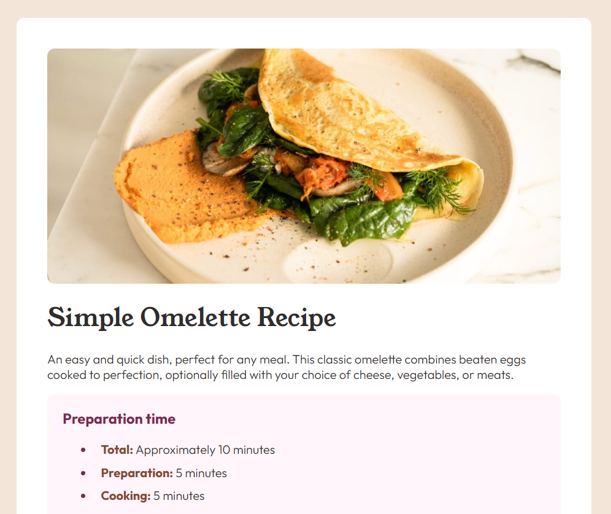

# Frontend Mentor - Recipe page solution

This is a solution to the [Recipe page challenge on Frontend Mentor](https://www.frontendmentor.io/challenges/recipe-page-KiTsR8QQKm). Frontend Mentor challenges help you improve your coding skills by building realistic projects. 

## Table of contents

- [Overview](#overview)
  - [The challenge](#the-challenge)
  - [Screenshot](#screenshot)
  - [Links](#links)
- [My process](#my-process)
  - [Built with](#built-with)
  - [Continued development](#continued-development)
  - [Useful resources](#useful-resources)
- [Author](#author)

## Overview

This challenge helped on writing semantic HTML. Ensuring which HTML elements are most appropriate for each piece of content.

### Screenshot

### Links

- Live Site URL: [Add live site URL here](https://your-live-site-url.com)

## My process

### Built with

- Semantic HTML5 markup
- CSS custom properties
- Mobile-first workflow

### Continued development

This was a fun, straightforward exercise that trained my eye to replicate a visual design as closely as possible in a functional landing page using HTML and CSS. Moving forward, I plan to apply this approach to more complex projects that incorporate advanced functionalities.

### Useful resources

- [W3Schools](https://www.w3schools.com/) - A useful website that helped me refresh my skills on some CSS styling properties.

## Author

- Frontend Mentor - [@justzaid](https://www.frontendmentor.io/profile/justzaid)
